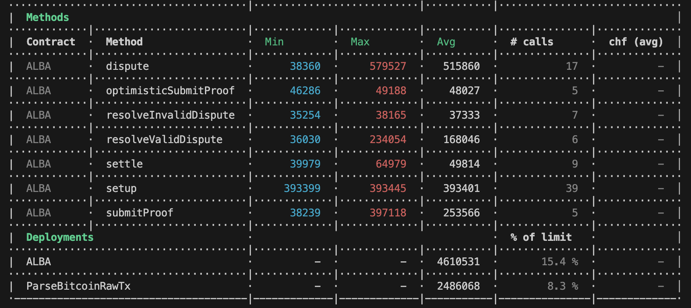
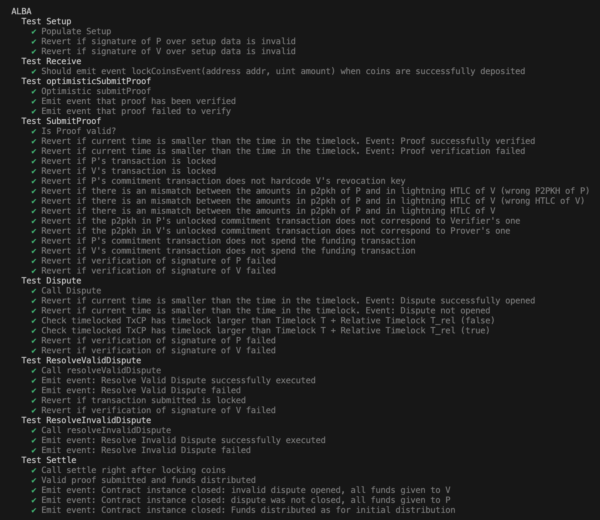
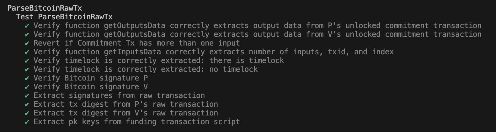

# Proof-of-Concept of the ALBA Smart Contract

*This code is for educational purposes only and it should not be used in production.*

## The ALBA Protocol
A Proof-of-Concept implementation of the ALBA protocol, connecting the Lightning Network (LN, a layer-2 on top of Bitcoin) to Ethereum. It allows to verify on Ethereum (or on any other EVM-based chain) the state of a LN channel, either the current state of the channel or an upcoming update thereof. 

Costs are evaluated both in the optimistic (both parties are honest and cooperate) and in the pessimistic (one of the parties is adversarial) setting.  

This work has been published at the [Network and Distributed System Security (NDSS) Symposium 2025](https://www.ndss-symposium.org/ndss2025/), and it is available on eprint [here](https://eprint.iacr.org/2024/197).

## Prerequisites

Please make sure that Docker is installed in your commodity laptop. You can download Docker [here](https://docs.docker.com/engine/install/).

## Build and Run

Once Docker is installed, clone this repository. Open a terminal and navigate to the project folder by running 

``` cd /path/to/the/cloned/repository ```

Build the Docker image by typing the following command within the Alba-Bridge folder:

``` docker build --no-cache -t alba . ```

Run the gas cost evaluation of Alba within Docker by executing the following command in your terminal:

``` docker run alba ```

## Notes
This project uses [Hardhat](https://hardhat.org/hardhat-runner/docs/getting-started) to compile, run, and test the smart contracts on a local development network. 

This project includes ParseBTCLib.sol a Solidity library for parsing Bitcoin transactions, including signature verification.

It also contains a python folder taken from [python-bitcoin-utils](https://github.com/karask/python-bitcoin-utils) and modified to generate protocol-specific LN transactions.

## Deployment architecture
For code-size constrained networks (e.g., Sepolia), see the contract split plan in `docs/STRUCTURE_SPLIT.md`.

## Contributing
This is a research prototype. We welcome anyone to contribute. File a bug report or submit feature requests through the issue tracker. If you want to contribute feel free to submit a pull request.

## Gas Cost Evaluation 


## Tests 
Tests for the contract

Tests for the library



## Sepolia Deployment Troubleshooting

If you want to run this project on Sepolia, use this checklist:

1. **Use a supported Node.js version** (recommended: Node 20 LTS).
2. Create a `.env` file from `.env.example` and fill all values:
   - `SEPOLIA_RPC_URL`
   - `DEPLOYER_PRIVATE_KEY`
   - `PROVER_PRIVATE_KEY`
   - `VERIFIER_PRIVATE_KEY`
3. Ensure all private keys are valid 32-byte hex strings (with `0x` prefix).
4. Ensure each account has enough Sepolia ETH for deployment and transactions.
5. Run local checks first:
   - `npx hardhat compile`
   - `npx hardhat test`
6. Deploy on Sepolia:
   - `npm run sepolia:deploy` (deploys `ALBAChannelFacet` + `ALBASplit`)
7. Copy the deployed address into `ALBA_ADDRESS` in `.env`.
8. Run the end-to-end channel demo:
   - `npm run sepolia:channel-demo`

### Common errors

- `hardhat: Permission denied`
  - Make sure your project directory is not mounted with `noexec`.
  - Reinstall dependencies: `rm -rf node_modules package-lock.json && npm install`.

- `could not detect network (noNetwork)`
  - Check `SEPOLIA_RPC_URL` and API key.
  - Verify connectivity with JSON-RPC `eth_chainId`.

- `Invalid account ... private key too short`
  - Your private key in `.env` is malformed (often still `0x...`).

- `ProviderError: max code size exceeded`
  - The full ALBA contract is too large for Sepolia code-size limits.
  - Use local Hardhat network for full prototype testing, or split/minimize contracts before Sepolia deployment.


- `YulException ... too deep inside the stack` during compile
  - This codebase can fail in IR mode on Solidity 0.8.9.
  - Keep `viaIR: false` in `hardhat.config.js`.
  - Run `npx hardhat clean && npx hardhat compile` after changing config.
